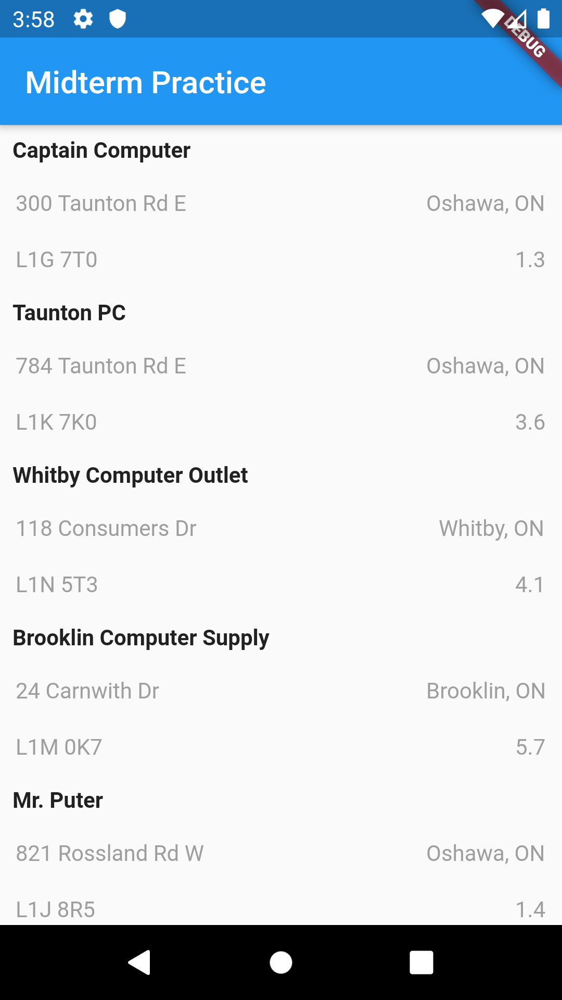
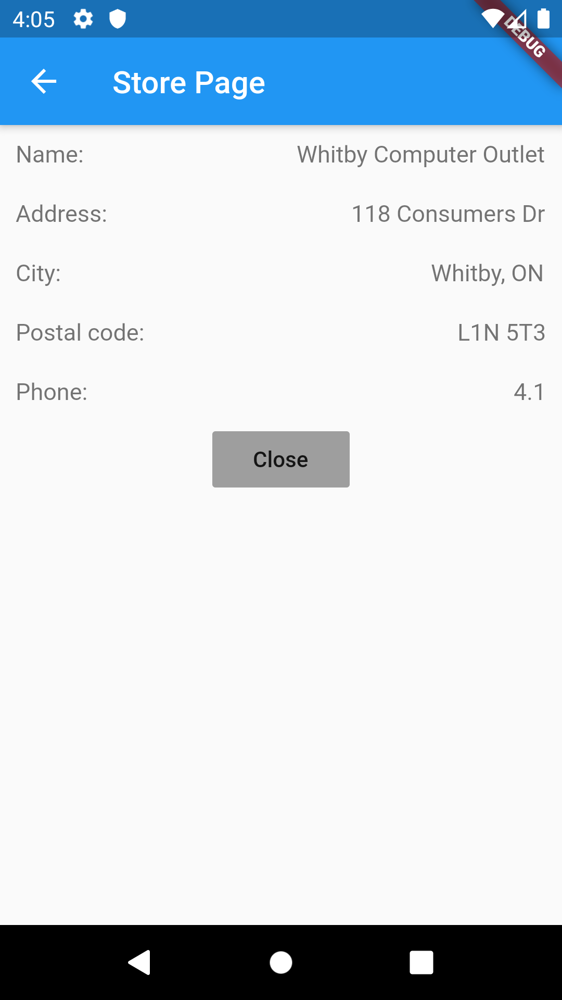

<h1> Mobile Devices Midterm Practice APP </h1>
Created By: Mohamamd Mushfequr Rahman

<h3> Designed using Flutter and Dart </h3>

The application downloads data from an online URL and parses the XML files in order to display the information using a ListView  

What the app looks like:

<h3> ListView: </h3>

<h3> A more detailed view: </h3>

